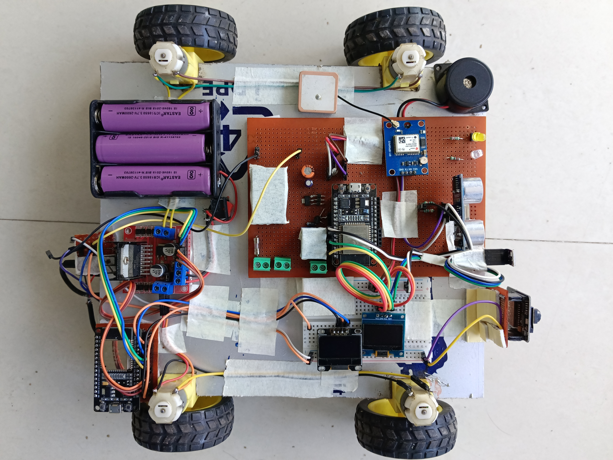

# 🚜 NETRA — Mining Safety Command Center

### AI-Enhanced Haul-Road Safety & Collision Avoidance System

**Smart India Hackathon (SIH) 2026 | Open-Cast Mining Safety**

<p align="center">

NETRA is a multi-layer safety-assistance system designed for open-cast mining haul roads, combining **Edge AI, sensor fusion, V2V communication, vehicle telemetry, local driver alerts, and a real-time command center**.

<br><br>

<a href="https://sih-2026-netra.vercel.app/#/command-center">
  <strong>🚀 OPEN LIVE COMMAND CENTER</strong>
</a>

</p>

---

## 🌐 Live Demo

### 🖥️ NETRA Command Center

👉 **Live Dashboard:**
https://sih-2026-netra.vercel.app/#/command-center

The command center provides a centralized view of:

* 🚛 Live vehicle locations
* ⚠️ Active safety alerts
* 📡 Communication status
* 📊 Vehicle telemetry
* 🛣️ Haul-road and blind-curve conditions
* 🔴 Risk levels
* 📋 Alert and incident information

---

# 🎯 Problem

Open-cast mining haul roads operate with large HEMM dumpers in challenging conditions.

Key safety challenges include:

* 🌫️ Dense fog and severely reduced visibility
* 🛣️ Blind curves and restricted line-of-sight
* 🚛 Multiple heavy vehicles operating simultaneously
* 📡 Intermittent or unavailable communication
* ⚠️ Unexpected obstacles and unsafe proximity
* ⏱️ Limited reaction time during critical situations

Traditional monitoring can depend heavily on driver visibility, manual observation, and network availability.

**NETRA adds an intelligent, multi-layer safety layer that can detect and communicate potential hazards locally while also providing centralized fleet monitoring.**

---

# 💡 NETRA Solution

NETRA combines:

**On-Vehicle Sensing + Edge Processing + V2V Communication + Long-Range Communication + Centralized Monitoring**

### Safety Pipeline

```text
Sensors
   ↓
ESP32 Edge Controller
   ↓
Sensor Fusion / Risk Assessment
   ↓
┌─────────────────────┬─────────────────────┐
│                     │                     │
▼                     ▼                     ▼
Local Alert        V2V Communication     Telemetry
│                     │                     │
▼                     ▼                     ▼
OLED / LED /       nRF24 / LoRa        FastAPI
Buzzer                                  Backend
                                          │
                                          ▼
                                   React Dashboard
```

---

# 🏗️ System Architecture



NETRA follows a layered architecture:

### 1. 🚛 Vehicle Layer

The prototype vehicle collects information from multiple sensors and communicates with the edge controller.

### 2. 🧠 Edge Layer

The ESP32 performs local processing and safety-state generation, reducing dependence on continuous cloud connectivity.

### 3. 📡 Communication Layer

Multiple communication mechanisms are used for different operating conditions:

* nRF24-based local V2V communication
* LoRa long-range communication
* Wi-Fi / Internet communication

### 4. 🖥️ Command Center

The React-based command center receives telemetry and safety information through the FastAPI backend and WebSocket communication.

### 5. 🔔 Driver Interface

The vehicle can provide immediate local warnings through:

* OLED displays
* LED indicators
* Buzzer
* Safety-state information

---

# 🚨 Key Features

## 🚛 Vehicle Monitoring

* GPS-based vehicle positioning
* Vehicle identification
* Real-time telemetry
* Vehicle status monitoring
* Fleet-level monitoring

## 🌫️ Hazard & Proximity Detection

NETRA can integrate sensor information such as:

* LiDAR / ToF sensing
* Radar
* Camera
* GPS
* Environmental / fog sensing
* Vehicle motion data

## 🧠 Edge Intelligence

Local processing enables rapid safety decisions without requiring every decision to travel to a remote server.

```text
Sensor Data
     ↓
Preprocessing
     ↓
Feature Extraction
     ↓
Risk Assessment
     ↓
Safety State
```

## 📡 Multi-Layer Communication

| Communication    | Purpose                               |
| ---------------- | ------------------------------------- |
| nRF24L01         | Local V2V communication               |
| LoRa             | Long-range communication              |
| Wi-Fi / Internet | Backend & command-center connectivity |
| WebSocket        | Real-time dashboard updates           |

## 🔊 Driver Alerts

When a risk condition is detected, the vehicle interface can provide:

* 🟢 Safe indication
* 🟡 Caution warning
* 🔴 Hazard warning
* OLED information
* LED indication
* Audible buzzer alert

## 🖥️ Real-Time Command Center

The dashboard provides:

* Live vehicle map
* Risk monitoring
* Active alerts
* Vehicle telemetry
* Communication status
* Incident information
* Fleet monitoring
* Blind-curve safety information

---

# ⚠️ Risk Classification

| Risk State | Example Condition                                        | Response                                        |
| ---------- | -------------------------------------------------------- | ----------------------------------------------- |
| 🟢 SAFE    | Normal operating conditions                              | Normal monitoring                               |
| 🟡 CAUTION | Reduced visibility, approaching risk, or stale telemetry | Driver warning / recommended speed reduction    |
| 🔴 HAZARD  | Critical proximity or high-risk condition                | Immediate local warning / safety recommendation |

> Thresholds can be configured according to the deployment environment and validated through field testing.

---

# 🚗 Prototype Hardware

### Front View


The NETRA prototype integrates an embedded controller, vehicle drive system, sensing modules, communication modules, GPS, display interfaces, and local warning components.

### Hardware Components

| Component          | Purpose                                  |
| ------------------ | ---------------------------------------- |
| ESP32              | Edge controller & wireless communication |
| GPS Module         | Vehicle positioning                      |
| LoRa Module        | Long-range communication                 |
| nRF24L01           | Local V2V communication                  |
| LiDAR / ToF Sensor | Proximity measurement                    |
| Ultrasonic Sensor  | Short-range distance sensing             |
| Camera             | Visual sensing                           |
| OLED Displays      | Driver information                       |
| RGB LEDs           | Safety-state indication                  |
| Buzzer             | Audible warning                          |
| Motor Driver       | Prototype vehicle movement               |
| DC Motors          | Vehicle propulsion                       |

### Top View


---

# 🔄 Working Methodology

## Step 1 — Data Acquisition

The vehicle collects information from sensors and communication modules.

```text
GPS
LiDAR / ToF
Radar
Camera
Motion Sensors
Communication Modules
        ↓
      ESP32
```

## Step 2 — Local Processing

Sensor information is processed locally to generate relevant safety parameters.

```text
Raw Sensor Data
      ↓
Preprocessing
      ↓
Feature Extraction
      ↓
Risk Assessment
```

## Step 3 — Risk Evaluation

The system evaluates factors such as:

* Distance
* Relative movement
* Closing speed
* Time-to-collision
* Vehicle state
* Communication status
* Visibility / environmental conditions

## Step 4 — Local Safety Response

The vehicle can immediately communicate the safety state to the driver.

```text
Risk Detected
     ↓
┌────┼─────────┐
▼    ▼         ▼
OLED LED     Buzzer
```

## Step 5 — Remote Monitoring

Telemetry and safety information are sent to the backend.

```text
Vehicle
   ↓
Communication Layer
   ↓
FastAPI Backend
   ↓
Database
   ↓
WebSocket / API
   ↓
React Command Center
```

---

# 📡 Communication Architecture

```text
                    ┌──────────────┐
                    │    VEHICLE   │
                    └──────┬───────┘
                           │
          ┌────────────────┼────────────────┐
          │                │                │
          ▼                ▼                ▼
       nRF24             LoRa         Wi-Fi / Internet
          │                │                │
          ▼                ▼                ▼
        V2V          LoRa Gateway     FastAPI Backend
                                           │
                                           ▼
                                    React Dashboard
```

### nRF24L01

Used for local vehicle-to-vehicle communication in the prototype.

### LoRa

Provides a long-range, low-bandwidth communication path for telemetry and safety information.

### Wi-Fi / Internet

Connects the vehicle/backend infrastructure with the live command center when network connectivity is available.

---

# 🧠 Edge AI & Sensor Fusion

NETRA's architecture supports local intelligence for rapid safety assessment.

```text
             SENSOR INPUTS
                  │
        ┌─────────┼─────────┐
        ▼         ▼         ▼
      LiDAR      Radar     Camera
        │         │         │
        └─────────┼─────────┘
                  ▼
            Sensor Fusion
                  ↓
            Risk Assessment
                  ↓
          Safety Classification
          /        |        \
       SAFE     CAUTION    HAZARD
```

Potential model inputs include:

* Distance
* Closing speed
* Time-to-collision
* Acceleration
* Gyroscope data
* Vehicle speed
* Communication health
* Environmental conditions

---

# 🖥️ Command Center


The live command center acts as the operator-facing monitoring layer.

### Dashboard Modules

* 🗺️ Mine / haul-road map
* 🚛 Vehicle tracking
* ⚠️ Alert feed
* 📊 Analytics
* 🛣️ Visibility monitoring
* 🚨 Incident monitoring
* 📡 Network status
* 🔄 Real-time telemetry

### 🌐 Live Dashboard

**[🚀 Open NETRA Command Center](https://sih-2026-netra.vercel.app/#/command-center)**

---

# 🛠️ Technology Stack

## Frontend

```text
React
TypeScript
Vite
Map-based visualization
WebSocket
```

## Backend

```text
Python
FastAPI
SQLAlchemy
Alembic
WebSocket
REST APIs
```

## Embedded

```text
ESP32
C/C++
GPS
LoRa
nRF24
OLED
Sensors
```

## AI / Computer Vision Architecture

```text
Edge AI
TinyML
YOLO-based vision processing
Computer Vision
Sensor Fusion
```

---

# 📁 Project Structure

```text
Netra/
│
├── backend/
│   ├── app/
│   │   ├── api/
│   │   ├── constants/
│   │   ├── core/
│   │   ├── database/
│   │   ├── schemas/
│   │   ├── services/
│   │   └── websocket/
│   ├── migrations/
│   ├── scripts/
│   ├── tests/
│   ├── requirements.txt
│   └── README.md
│
├── frontend/
│   ├── public/
│   ├── src/
│   │   ├── components/
│   │   ├── contexts/
│   │   ├── data/
│   │   ├── hooks/
│   │   ├── map/
│   │   ├── pages/
│   │   ├── services/
│   │   ├── styles/
│   │   ├── types/
│   │   └── utils/
│   ├── package.json
│   └── vite.config.ts
│
├── hardware/
│   └── esp32_hemm_telemetry/
│       └── esp32_hemm_telemetry.ino
│
├── docs/
│   └── images/
│       ├── IMG_20260929_163046.jpg.jpeg
│       ├── IMG_20260929_163059.jpg.jpeg
│       └── Screenshot 2026-09-30 002843.png
│
├── package.json
├── package-lock.json
└── README.md
```

---

# 🚀 Quick Start

## 1. Clone Repository

```bash
git clone https://github.com/1Fahad-2/Netra.git
cd Netra
```

## 2. Backend Setup

```bash
cd backend
```

Create a virtual environment:

```bash
python -m venv venv
```

### Windows

```bash
venv\Scripts\activate
```

Install dependencies:

```bash
pip install -r requirements.txt
```

Start the backend:

```bash
python -m uvicorn app.main:app --reload --port 8000
```

Backend:

```text
http://127.0.0.1:8000
```

Swagger documentation:

```text
http://127.0.0.1:8000/docs
```

## 3. Frontend Setup

Open another terminal:

```bash
cd frontend
npm install
npm run dev
```

The dashboard will normally be available at:

```text
http://127.0.0.1:5173
```

---

# 🔌 Backend Communication

NETRA exposes REST and WebSocket interfaces for telemetry and real-time communication.

```text
ESP32 / Vehicle
      │
      ▼
Communication Layer
      │
      ▼
FastAPI
      │
 ┌────┴────┐
 ▼         ▼
Database  WebSocket
             │
             ▼
       React Dashboard
```

---

# 📊 Data Flow

```text
┌────────────────────┐
│ GPS / Sensors      │
└─────────┬──────────┘
          ▼
┌────────────────────┐
│ ESP32 Edge Layer   │
└─────────┬──────────┘
          ▼
┌────────────────────┐
│ Risk Assessment    │
│ & Sensor Fusion    │
└─────────┬──────────┘
          │
     ┌────┴────┐
     ▼         ▼
 Local       Remote
 Safety      Telemetry
     │         │
     ▼         ▼
OLED/LED    Communication
/Buzzer         │
                ▼
          FastAPI Backend
                │
        ┌───────┴───────┐
        ▼               ▼
    Database        WebSocket
                        │
                        ▼
                React Dashboard
```

---

# 🧪 Prototype Status

NETRA is an **SIH 2026 prototype** integrating:

```text
Hardware
   +
Embedded Systems
   +
Sensor Fusion
   +
Edge Intelligence
   +
V2V Communication
   +
Vehicle Telemetry
   +
FastAPI Backend
   +
Database
   +
Real-Time React Dashboard
```

The prototype demonstrates how local vehicle safety mechanisms can work together with centralized fleet monitoring.

---

# 🔮 Future Scope

Potential future improvements include:

* 📍 RTK-GPS for high-precision positioning
* 📡 Industrial-grade communication
* 📡 Long-range radar / LiDAR
* 👁️ Advanced AI camera monitoring
* 🌡️ Thermal sensing
* 😴 Driver fatigue monitoring
* 🛣️ Road-condition monitoring
* 🚛 Fleet-wide deployment
* 📱 Emergency GSM/SMS communication
* 🧠 Advanced sensor-fusion models
* ☁️ Historical fleet analytics
* 🔐 Industrial cybersecurity
* 🏭 Integration with mine-specific safety infrastructure

---

# ⚠️ Disclaimer

NETRA is an **SIH 2026 research and demonstration prototype**.

Real-world mining deployment would require:

* Industrial-grade hardware
* Extensive field testing
* Mine-specific validation
* Safety certification
* Regulatory compliance
* Environmental testing
* Reliability testing
* Fail-safe validation

**NETRA should not be treated as a certified autonomous vehicle-control or safety-critical system.**

---

# 👥 Team TVYOM

### NETRA — SIH 2026

The project combines expertise across:

| Area             | Responsibility                     |
| ---------------- | ---------------------------------- |
| Embedded Systems | ESP32, sensors & vehicle interface |
| AI / ML          | Risk assessment & Edge AI          |
| Computer Vision  | Camera-based hazard detection      |
| Backend          | FastAPI, database & WebSocket      |
| Frontend         | React command center               |
| Hardware         | Vehicle prototype & electronics    |
| Communication    | V2V, LoRa & telemetry              |

---

# 🏆 Smart India Hackathon 2026

NETRA is developed as part of **Smart India Hackathon (SIH) 2026**, focusing on intelligent safety assistance for open-cast mining haul-road operations.

---

# ⭐ NETRA

### **Sense. Communicate. Warn. Protect.**

<p align="center">

🚛 **Vehicle Safety**   •  
📡 **V2V Communication**   •  
🧠 **Edge Intelligence**   •  
🖥️ **Live Command Center**

</p>
